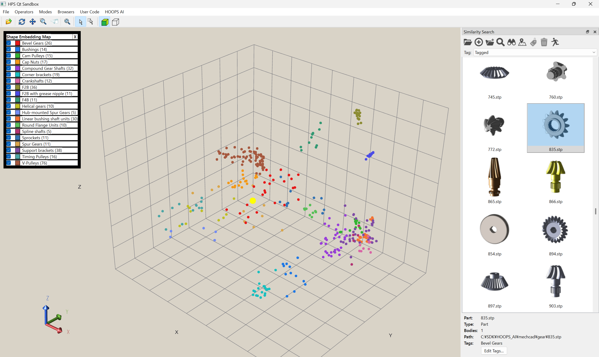
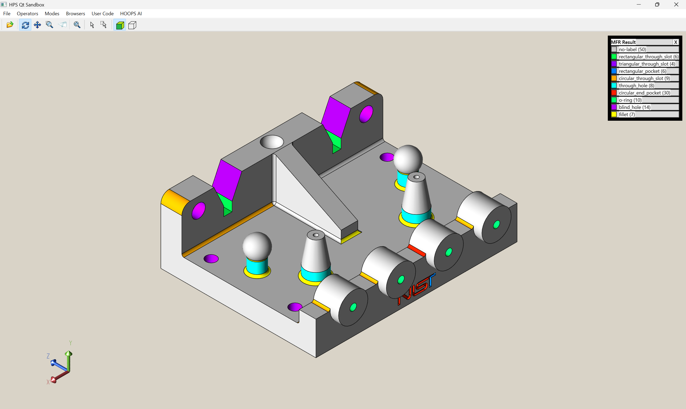
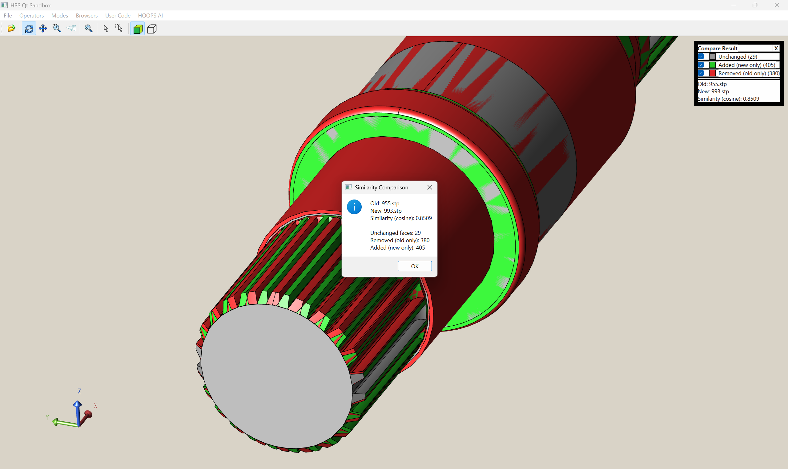
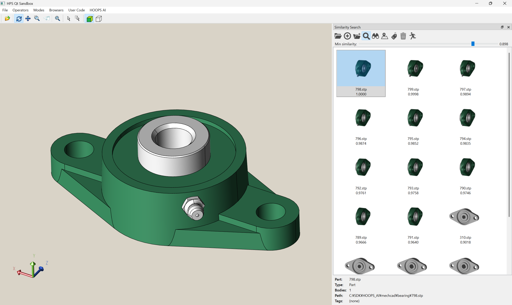
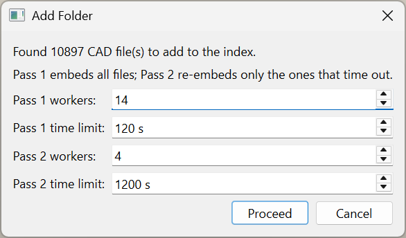

# hoops_ai_qt_sandbox

A Qt sample application that combines **HOOPS Visualize Desktop**, **HOOPS Exchange**, and the
**HOOPS AI Native Bridge** to demonstrate AI-assisted CAD workflows:

- **MFR (Manufacturing Feature Recognition)** — classify every face of a loaded model and color it
  by the recognized manufacturing feature, with a legend.
- **Shape similarity comparison** — compute the cosine similarity between two loaded parts using a
  shape-embeddings model.
- **Similarity Search panel** — build/open a FAISS index, add CAD files or whole folders, search
  for similar parts, run assembly-to-assembly similarity search, tag parts, and visualize the
  entire index as a clustered **Shape Embedding Map** in the 3D view.

It is derived from the `qt_sandbox` sample shipped with HOOPS Visualize Desktop, extended with the HOOPS AI
integration. The C API it calls lives in a companion repository,
[`hoops_ai_native_bridge`](../hoops_ai_native_bridge), which embeds a Python interpreter running the
HOOPS AI package.

> **This is a proof of concept, not a product.** It exists to demonstrate that HOOPS AI can be made
> to work inside a native HOOPS Visualize Desktop + Exchange application, and is not intended to be
> shipped as is. The trained models used here (MFR and similarity search) are the sample `.ckpt`
> files from the HOOPS AI tutorials; a production system would train models against its own parts and
> label scheme. Treat this repository as a starting point rather than production-quality code.

<p align="center">
  <br>
  <em>Shape Embedding Map — the whole index projected into a clustered 3D map, colored by tag,
  with the matching part gallery on the right.</em>
</p>

## Prerequisites

| Component | Version |
| --- | --- |
| HOOPS Visualize Desktop | 2026.2.0 |
| HOOPS Exchange | 2026.2.0 (must match the version used by HOOPS AI — see notes below) |
| HOOPS AI | V1.1 |
| `hoops_ai_native_bridge` | matching build |
| Qt | 6.5.3 (msvc2019_64 on Windows / gcc_64 on Linux, or a distro Qt6 package) |
| Python | 3.12 |
| Visual Studio (Windows) | 2022 |
| CMake (Linux, to build `hoops_ai_native_bridge`) | 3.20+ |

A valid HOOPS license is required. A single unified key covers all three products — HOOPS AI, HOOPS
Visualize Desktop, and HOOPS Exchange — so make sure the key you use has all three enabled (HOOPS AI is
available for evaluation). The license is read from `hoops_license.h`, which is **not** tracked in
this repository (see `.gitignore`); create it locally with your `HOOPS_LICENSE` string.

## Setup

### Windows

1. Copy the environment template and create your own `_VS2022.bat`:

   ```powershell
   Copy-Item _VS2022.bat.example _VS2022.bat
   ```

2. Edit the paths in `_VS2022.bat` to match your environment:

   - `HVISUALIZE_INSTALL_DIR` — HOOPS Visualize Desktop install directory
   - `HEXCHANGE_INSTALL_DIR` — HOOPS Exchange install directory
   - `HAI_BRIDGE_INSTALL_DIR` — `hoops_ai_native_bridge` install directory
   - `QT_INSTALL_DIR` — Qt 6.5.3 (msvc2019_64) install directory
   - `HOOPS_AI_HOME` — *(optional, development only)* resolves site-packages at
     `<home>\.venv\Lib\site-packages`. When unset, the client falls back to the redistribution
     layout `<exe>\..\.venv\Lib\site-packages`. The client resolves site-packages and passes it to
     the bridge as UTF-8.
   - `HOOPS_AI_PYTHON_HOME` — *(optional)* Python 3.12 install directory. Normally not needed: the
     bridge auto-detects Python from the Windows registry (PEP 514). Set it only for unusual
     configurations where auto-detection fails.
   - `devenv.exe` path — adjust to your Visual Studio 2022 edition.

   `_VS2022.bat` contains machine-specific paths and is excluded from version control via
   `.gitignore`. Recreate it on each machine.

3. Run `_VS2022.bat`. It launches Visual Studio 2022 with the environment variables set and opens
   `hps_qt_sandbox.sln`.

4. Select the **Debug** or **Release** configuration and build/run.

### Linux

The project builds with qmake/make; there is no IDE step. All SDK/toolchain locations come from
environment variables (`hps_qt_sandbox.pro` never hardcodes a path), so the same steps work on any
machine.

1. Install the toolchain and headers (Ubuntu/Debian package names):

   ```bash
   sudo apt-get install -y build-essential qt6-base-dev qt6-base-dev-tools \
       libgl1-mesa-dev libx11-dev libxmu-dev libxcb-cursor0 cmake
   ```

   A system Qt6 (`qt6-base-dev`) is enough if you don't need an exact Qt version; otherwise install
   Qt 6.5.3 (e.g. via the Qt online installer) and point `QT_INSTALL_DIR` at it in step 2.

2. Copy the environment template and edit the paths:

   ```bash
   cp _linux_env.sh.example _linux_env.sh
   # edit HVISUALIZE_INSTALL_DIR, HEXCHANGE_INSTALL_DIR, HAI_BRIDGE_INSTALL_DIR,
   # QT_INSTALL_DIR, HOOPS_AI_HOME in _linux_env.sh
   source _linux_env.sh
   ```

   `_linux_env.sh` contains machine-specific paths and is excluded from version control via
   `.gitignore` (like `_VS2022.bat` on Windows) — recreate it on each machine.

3. Build the `hoops_ai_native_bridge` shared library for this machine (a prebuilt `.so` from a
   different glibc/Python build won't load — see notes below):

   ```bash
   cd "$HAI_BRIDGE_INSTALL_DIR"
   cmake -S . -B build && cmake --build build
   ```

4. Build the sandbox itself. Run this back in the **repository root** (where `hps_qt_sandbox.pro`
   lives), not in `$HAI_BRIDGE_INSTALL_DIR` — `cd` back there first if you're still in the bridge
   directory from step 3:

   ```bash
   cd /path/to/hoops_ai_qt_sandbox   # the repo root; cd back here if still in $HAI_BRIDGE_INSTALL_DIR
   mkdir -p build_linux && cd build_linux
   qmake ../hps_qt_sandbox.pro -o Makefile
   nice -n 10 make -j2   # low -j keeps memory usage down on constrained VMs; raise if you have RAM to spare
   ```

   The executable is produced at `$HVISUALIZE_INSTALL_DIR/bin/linux64/hps_qt_sandbox` (its rpath
   already covers the Qt, Visualize, Exchange, and bridge lib directories).

5. Run it (the same `HVISUALIZE_INSTALL_DIR`/`HEXCHANGE_INSTALL_DIR`/`HOOPS_AI_HOME` env vars from
   `_linux_env.sh` are also read at *runtime*, not just at build time — `main.cpp` uses them to
   locate the materials/fonts, Exchange, and Python site-packages directories):

   ```bash
   source _linux_env.sh   # if not already sourced in this shell
   "$HVISUALIZE_INSTALL_DIR/bin/linux64/hps_qt_sandbox"
   ```

   On a Wayland session, HOOPS' X11/GLX-based window embedding needs XWayland; force it with
   `QT_QPA_PLATFORM=xcb`.

**Notes**

- The `libhoops_ai_bridge.so` ABI embeds CPython and needs a matching shared `libpython3.12` on the
  target machine at runtime (resolved automatically if it's a system package, e.g. Ubuntu 24.04's
  `libpython3.12-dev`/`libpython3.12t64`). Building the bridge on the same machine (step 3) avoids
  glibc/Python ABI mismatches between machines.
- `USING_EXCHANGE` in `hps_qt_sandbox.pro` defaults to `1`; set it to `0` there if you only need the
  Visualize sample without Exchange/HOOPS AI.
- `hps_sprk_exchange` loads Exchange's shared library by its unversioned name, `libA3DLIBS.so`, but
  the Exchange package under `bin/linux64/` only ships the versioned file (e.g.
  `libA3DLIBS.so.26.2.0`). If you see `WARNING! Cannot find Exchange libraries` or the app aborts
  with `failed to load Exchange libraries`, create the missing symlink once per Exchange install:

  ```bash
  cd "$HEXCHANGE_INSTALL_DIR/bin/linux64"
  ln -sf libA3DLIBS.so.26.2.0 libA3DLIBS.so   # adjust the version suffix to match what's shipped
  ```

## Loading AI models (`.ckpt`)

The MFR model and the similarity-search (embeddings) model are loaded on demand from the **File**
menu:

- Choose **File > Load MFR Model…** or **File > Load Similarity Search Model…** and pick a `.ckpt`.
- If you run an MFR or similarity command with no model loaded, the model-selection dialog appears
  automatically.
- A loaded model is kept for the lifetime of the process and reused without prompting. Pick another
  file from the File menu to swap it (the MFR and similarity slots are independent).
- Default folder of the selection dialog:
  - `HOOPS_AI_HOME` set: `<HOOPS_AI_HOME>\packages\trained_ml_models`
  - unset: `<exe>\..\models` (redistribution layout; falls back to the exe folder if absent)

## Redistribution (running on a clean machine)

This app fits the same redistribution framework as `hoops_ai_native_bridge` (see its README): build a
package with `hoops_ai`'s traced `site-packages`, drop the app + runtime next to it, and the whole
folder runs by a plain copy — no environment variables. When the `HVISUALIZE_INSTALL_DIR` /
`HEXCHANGE_INSTALL_DIR` / `HOOPS_AI_HOME` variables are **unset**, `main.cpp` resolves every resource
directory relative to the executable, using this layout:

```
<package>\
  bin\                     # exe + all DLLs
    hps_qt_sandbox.exe
    hoops_ai_bridge.dll
    <Qt DLLs>              # Qt6Core/Gui/Widgets + platforms\qwindows.dll (deploy with windeployqt)
    <HPS Visualize DLLs>   # sprk / base / 3dgs, etc.
    <HOOPS Exchange DLLs>  # A3DLIBS.dll and friends (flattened from bin\win64_v142)
  .venv\Lib\site-packages\ # bundled hoops_ai site-packages   -> HOOPS AI
  models\                  # *.ckpt                            -> AI model dialog default
  materials\               # HOOPS Visualize Desktop material library -> SetMaterialLibraryDirectory
  fonts\                   # HOOPS Visualize Desktop fonts            -> SetFontDirectory
  resource\                # HOOPS Exchange Publish resources  -> SetPublishResourceDirectory
```

Resolution when the env vars are unset (all relative to the exe in `bin\`):

| Resource | Redistribution path | Notes |
|---|---|---|
| HOOPS AI site-packages | `<exe>\..\.venv\Lib\site-packages` | passed to `HoopsAI_Initialize` |
| Visualize materials | `<exe>\..\materials` | falls back to the dev source tree if absent |
| Visualize fonts | `<exe>\..\fonts` | falls back to the dev source tree if absent |
| Exchange binaries | `<exe>` (same folder as the exe) | `SetExchangeLibraryDirectory` + raw A3D load |
| Exchange Publish resource | `<exe>\..\resource` | only used when Publish is enabled |
| AI models (`.ckpt`) | `<exe>\..\models` | model-selection dialog default |

The target machine still needs, installed separately (not bundled):

**Windows**

- **Python 3.12** from python.org, so `python312.dll` is found via the PEP 514 registry **and** a real
  `python.exe` exists — the latter is required by the parallel Add Folder workers
  (`multiprocessing` spawn). Without it, parallel embedding is disabled and clamped to one worker.
- The **Visual C++ redistributable** (x64) is required.

**Linux**

- **Python 3.12** with a shared `libpython3.12` on the target (see the Linux build notes above), plus
  a real `python3.12` executable for the parallel Add Folder workers (`multiprocessing` spawn).
- The toolchain runtime libraries (glibc, `libstdc++`, the GL/X11 libs listed in the Linux setup).

On both platforms only the **x86-64** CPU architecture is supported. HOOPS AI itself supports GPU,
but `hoops_ai_native_bridge` does not at this time.

> **Redistribution licensing is a separate question from what technically runs.** The package mixes
> components under different terms: whether HOOPS AI, the trained `.ckpt` checkpoints, and the HOOPS
> Visualize Desktop / HOOPS Exchange binaries may be redistributed depends on your Technology Partner
> Agreement (TPA) and varies by country and agreement, while the bundled Qt DLLs follow Qt's own
> licensing (LGPL or commercial). No single agreement covers all of it — confirm the terms that apply
> to you before shipping.

## Using the app

### MFR Inference (HOOPS AI menu)

Open a model, then run to color every face by its recognized manufacturing feature; a legend lists
the features and their face counts.

<p align="center"></p>

### Similarity Comparison (HOOPS AI menu)

Open a base model with **File > Open**, bring in a second part with **File > Add**, then run to get
the cosine similarity of the two shapes. The faces are colored **Unchanged / Added (new only) /
Removed (old only)** and a dialog reports the cosine score and the per-group face counts.

<p align="center"></p>

### Similarity Search panel

Toggle the panel from the **HOOPS AI** menu. It builds and queries a FAISS index of shape
embeddings and visualizes it in the 3D view. All commands live on the panel's toolbar, in the order
below.

The toolbar has two modes:

- **Listing mode** (Search and Assembly Search both OFF): the list shows the parts registered in
  the index. The **Tag** filter (All / Tagged / a specific tag) applies here.
- **Search mode** (Search or Assembly Search ON, mutually exclusive): the list shows the query
  results, filtered by the **similarity slider** (a minimum cosine/blended score). The Tag filter is
  disabled in this mode.

<p align="center">
  <br>
  <em>Search mode: parts ranked by similarity to the loaded model, each thumbnail labeled with its
  score and gated by the Min-similarity slider.</em>
</p>

| Icon | Command | What it does |
|:----:|---------|--------------|
|  | **Open Index…** | Open an existing `.faiss` index, or create one at the chosen path, and make it the current index. Requires the similarity-search model to be loaded. |
|  | **Add Current Model** | Embed the model currently loaded in the 3D view and register it in the index. |
|  | **Add Folder…** | Batch-embed and register every supported CAD file in a folder using a two-pass strategy (see below). |
|  | **Search with Current Model** *(toggle)* | ON: rank the index for **parts** similar to the current model (per-part matching). OFF: return to listing mode. |
|  | **Search Similar Assembly** *(toggle)* | ON: rank the index for whole **assemblies** similar to the current model (assembly-to-assembly: optimal one-to-one part matching with TF-IDF rare-part weighting and a bag-of-parts blend). OFF: return to listing mode. Mutually exclusive with Search. |
|  | **Shape Embedding Map** | Project the **tagged** parts of the index into a 2D/3D cluster map (one point per file, colored by tag) and show it in the 3D view. Selecting a part in the panel highlights its point, and picking a point selects the matching part. Each legend row has a checkbox to show/hide that group. |
|  | **Assign Tag…** | (Search mode) Assign a tag to every part currently shown by the similarity slider — the displayed cluster becomes that tag. |
|  | **Remove Tag** | (Listing mode) Remove the tag selected in the Tag filter from all of its parts. |
|  | **Close** | Close the current index (the `.faiss`/`.meta` files on disk are kept). |

**Typical workflow:** *Open Index → Add Current Model / Add Folder → Search (or Assembly Search) →
Assign Tag to the results → Shape Embedding Map* to inspect the tagged clusters in the 3D view.

#### Add Folder — two-pass embedding

Registering a folder can mix thousands of light parts with a few memory-heavy assemblies, so
**Add Folder** runs in two passes. When you pick a folder, a dialog reports how many CAD files were
found and lets you tune both passes before proceeding:



- **Pass 1 (all files):** embeds every file with many workers and a short per-file time limit. The
  many light parts finish here; a heavy assembly that exceeds the Pass 1 time limit is dropped with
  a *Timeout* and queued for Pass 2.
- **Pass 2 (heavy retry):** re-embeds only the timed-out files with a larger time limit and few
  workers (a single heavy file is not sped up by more workers). Files that failed with a real CAD
  error — not a timeout — are not retried. Anything that still times out after Pass 2 is skipped.

The dialog's defaults are auto-detected for the machine and are all editable:

| Field | Default | Notes |
|-------|---------|-------|
| Pass 1 workers | number of **physical** CPU cores | The embedding sweet spot; logical cores add little. |
| Pass 1 time limit | **120 s** | Short budget so light files stream through quickly. |
| Pass 2 workers | `floor(free RAM / 4 GB)` | Each heavy worker needs several GB of headroom. |
| Pass 2 time limit | **1200 s** | Generous budget to let a heavy assembly finish. |

Raise the **Pass 2 time limit** if large assemblies are still being skipped; lower the **Pass 2
workers** if Pass 2 runs out of memory.

## Important notes

- `HVISUALIZE_INSTALL_DIR` / `HEXCHANGE_INSTALL_DIR` must be the **same Exchange version** that HOOPS
  AI bundles (the venv's `hoops_exchange`); the shared low-level `Tf*` kernel DLLs collapse to a
  single instance in the process, so a mismatch crashes. Two further consequences of that shared
  kernel: **HOOPS AI must be initialized before the first Exchange import** (this app does so at
  startup), and at shutdown any loaded `CADModel` must be discarded before calling
  `HoopsAI_Shutdown()`.
- If a `Qt6Core.dll` (etc.) of a different version than the one used to build sits next to the
  Release executable, you may get entry-point errors at runtime. Avoid mixing Qt DLL versions.
